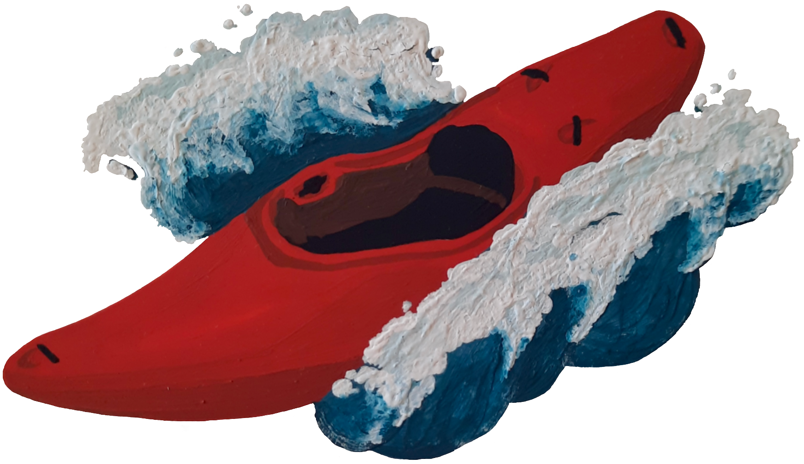

# Rapid Riot - Whitewater Festival Interactive Map

## Description

Explore Whitewater Paddling Festivals in North America using an interactive map/list interface.
Submit festivals that are not currently included in the map and report corrections via built in form submission.

Typescript / React / Mapbox / Supabase / Netlify

## Run the Project

To run the project in development mode:

#### `npm install`

#### `npm start`

Runs the app in the development mode.\
Open [http://localhost:3000](http://localhost:3000) to view it in the browser.

The page will reload if you make edits.\
You will also see any lint errors in the console.

## CI Status

